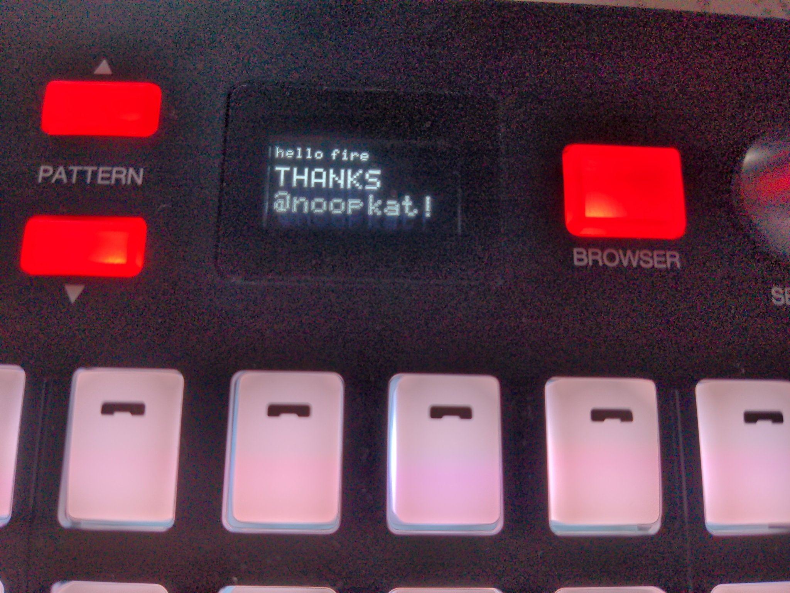

Drawing on a monochromatic bitmap canvas.



A library of drawing routines for a monochromatic bitmap canvas, ported to Dart from the awesome [oled-js](https://github.com/noopkat/oled-js) by @noopkat. 

The canvas is hardcoded to be monochromatic, hence each pixel is represented as a boolean value. 

This library can be useful when using small, cheap monochromatic OLED displays. 

It works well with the [oled_font_57](https://pub.dev/packages/oled_font_57) package.


## Example usage

```
import 'package:monochrome_draw/draw.dart';


main() {

    final MonoCanvas oledBitmap = MonoCanvas(128, 64);

    oledBitmap.drawLine(5, 5, 50, 50, true);
}
```